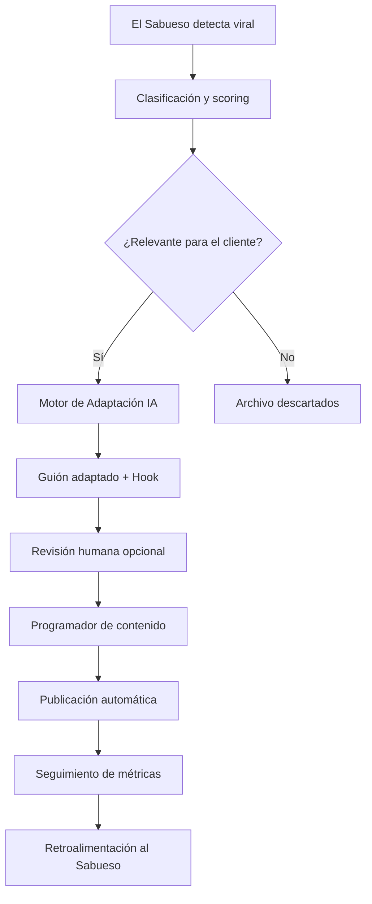

# SocialDrop — Ecosistema de Contenido Autónomo

> Sistema automatizado de planificación, generación y publicación de contenido en redes sociales. Reduce el tiempo de producción de contenido de horas a minutos mediante IA y automatización.

## Visión del Producto

SocialDrop es un ecosistema que cierra el ciclo completo del contenido:

```
Descubrimiento viral → Adaptación con IA → Programación → Publicación automática
       ↑                                                           |
       └───────────── Análisis de performance ←───────────────────┘
```

## Módulos Principales

| Módulo | Estado | Descripción |
|--------|--------|-------------|
| [[El Sabueso - Hub\|El Sabueso]] | Activo | Descubrimiento y clasificación de contenido viral |
| [[Pipeline de Publicacion]] | Activo | Programador y publicador multi-plataforma |
| [[Motor de Adaptacion IA]] | En desarrollo | Reescritura y adaptación de guiones con IA |
| [[Dashboard SocialDrop]] | Planificado | Centro de control y analíticas |
| [[Modulo WhatsApp Ventas]] | Activo | Cierre de ventas por WhatsApp automatizado |

## Flujo Completo del Sistema



## Stack Tecnológico

- **Descubrimiento:** [[El Sabueso - Hub|Apify scraping]] + TikTok/Instagram/YouTube APIs
- **Clasificación:** Lógica de scoring custom + [[Notion]] como base de datos
- **Adaptación:** Claude API / GPT-4 para reescritura
- **Publicación:** Buffer / Make (Integromat) / APIs nativas
- **Análisis:** Notion dashboard + webhooks

## KPIs del Proyecto

- Tiempo de producción por pieza: objetivo < 5 minutos
- Tasa de publicación automatizada: objetivo > 80%
- Viralidad adaptada: CTR vs benchmark del nicho

## Notas de Arquitectura

Ver [[Arquitectura SocialDrop]] para el diagrama técnico detallado y decisiones de diseño.

Ver [[Stack Tecnologico SocialDrop]] para versiones, credenciales y dependencias.

## Próximos Pasos

- [ ] Integrar feedback loop de métricas al motor de scoring de El Sabueso
- [ ] Implementar A/B testing automático de hooks
- [ ] Dashboard unificado cliente-facing
- [ ] Módulo de generación de thumbnails con IA

---

*Navegación: [[index]] | [[El Sabueso - Hub]] | [[Automatizacion Ventas - Hub]] | [[Club AI Marketing - Hub]]*
